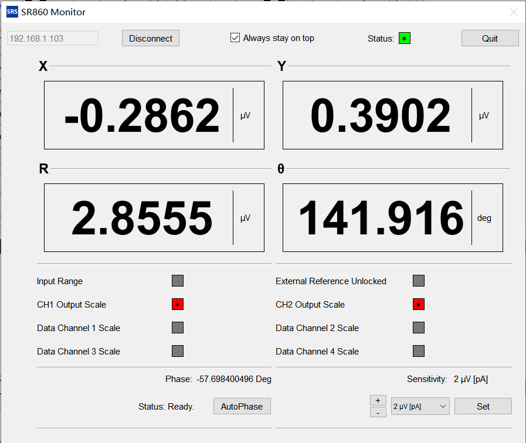

# Qt_SR860_Monitor

 A simple monitor for Stanford Research SR860 in Python and Qt.

 

The SR860 Lock-in Amplifier supports several remote ways for user to control it. However, the [official streaming example](https://www.thinksrs.com/downloads/programs/sr86x/SR86x_StreamingExamples.zip) needs socket programming with `vxi11` . I think it is less stable than the built-in web server provided by SR860, which works in a http`POST` way (though it is still built on `vxi11` essentially).

This tool catches response from SR860. All commands can be found in the [manual](https://www.thinksrs.com/downloads/pdfs/manuals/SR860m.pdf). You can even changes some code to work with SR86X.

> **Note**: Due to some unexpected reason, not every `POST` could get a correct response. After many attempts headers used here is perfectly consistent with browser, though. 

一个用Python和Qt编写的简单的SR860锁相放大器监控工具。

SR860锁相放大器支持多种远程方式以便用户控制。但官方提供的流式传输示例是需要socket编程与`vxi11`通信的。我觉得这种方式比起SR860自带的使用http`POST`方式的网页端不稳定，尽管这个网页端本质上也是基于`vxi11`。

这个工具捕捉来自SR860的Web响应。所有的命令可以在仪器使用手册里找到。你甚至可以修改代码来和其他SR86x系列的锁相放大器一起使用。

> **注意**：由于某些意料之外的原因，并不是每次`POST`请求可以得到正确的响应。虽然但是，尝试多次后这里用的headers是与浏览器里保持一致的。

## Requirements

+ Python 3 (developed in Python 3.7.9)
+ Pyside2
+ requests

## Usage

```sh
pip install -r requirements.txt
python main.py
```

## Future

+ Support customization according to your own work.